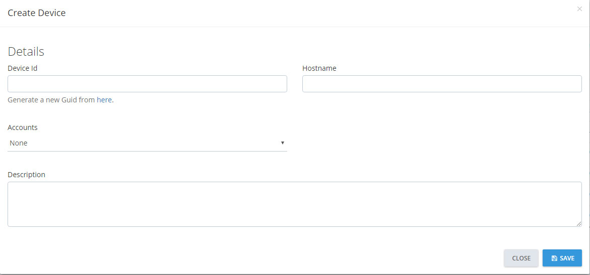

# Manual Setup

This guide is for deploying the LMS Agent when any of the following conditions are met:

- Not a customer.
- Not in AEM.
- Unable to deploy from AEM.

### Prerequisite

> If the target device is already in AEM then you can skip onto the next section.

before we manually install the LMS agent we must configure authentication.

1. Navigate to Custom Devices which can be found here [Administration > Custom Devices](https://portal.ct.co.uk/Administration/CustomDevices).
2. Select **Add New** which can be found above the table.
3. This will open a form modal. Here are the various fields you will need to fill in.

   - **Device Id**: This is what would be the CentraStage Id if it was installed. There is a link provided to randomly generate a new GUID.
   - **Hostname**: The hostname of the server. This can be changed after the device is created.
   - **Accounts**: This is a drop downlist of all the active Accounts stored in Autotask.
   - **Description**: Just a short description of why you are creating this custom device.

     ### **ALL fields are required.**



4. Save the form and make a note of the AccountID and DeviceID.

### Manual Installation

There are two methods for installation.

- Deploy.exe: Downloads the main setup file and runs a silent install.
- LMS.Setup.exe: Normal installation file.

The latest version can always be found at this [url.](https://github.com/CentralTechnology/lms-agent/releases/latest)

### Configure Credentials

Now that the LMS Agent has been installed on the target device, we need to input the credentials from the Prerequisite instructions.

There are two different interfaces for entering the AccountID and DeviceID, the GUI is the preferred method.

#### GUI

Navigate to the following directory `C:\Program Files (x86)\License Monitoring System\Configuration\`

Launch `Configuration.exe`


Enter the AccountID and DeviceID and hit Restart!

#### CLI

Enter the following command into an Administrator Powershell Window.

```powershell
cd "C:\Program Files (x86)\License Monitoring System\"
.\LMS.exe update --account 12345 --device 2ff7b98c-a9d9-4a37-b234-0c4c4d0292e2
```

Look at [User Interfaces](ui) for more CLI options.
