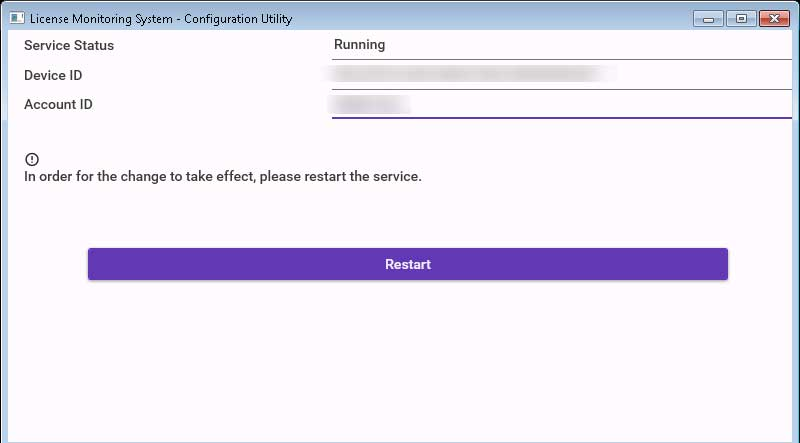
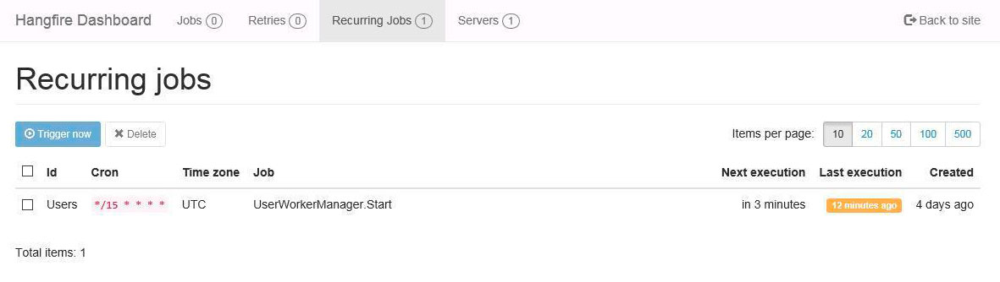
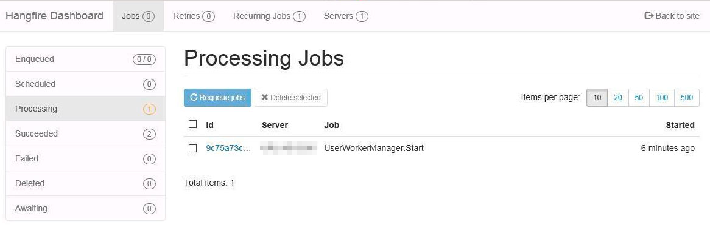
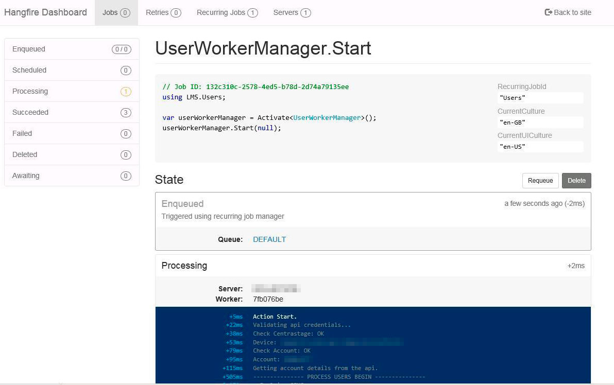

# User Interfaces

### GUI

Navigate to the following directory `C:\Program Files (x86)\License Monitoring System\Configuration\`

Launch `Configuration.exe`



### CLI

All the commands should be executed from a powershell terminal in the same directory as the agent executable.

#### Autotask Account

This should only be used when an agent requires manual authentication.
The command accepts an integer which should be the Autotask Account ID.

```powershell
.\LMS.exe update --account 12345
```

#### AEM Device

This should only be used when an agent requires manual authentication.
The command accepts a GUID which should be the AEM Device ID or the GUID that was entered into the Portal for manual authentication.

```powershell
.\LMS.exe update --device 2ff7b98c-a9d9-4a37-b234-0c4c4d0292e2
```

#### PDC Override

This should be only be used when the agent has been installed on a member server, not a primary domain controller.
This command accepts a boolean.

```powershell
.\LMS.exe update --pdc-override True
.\LMS.exe update --pdc-override False
```

#### Force User Monitoring

This should only be used when the startup checks fail and you know the agent can successfully monitor the server for users.
This command accepts a boolean.

```powershell
.\LMS.exe update --force-users True
.\LMS.exe update --force-users False
```

#### Force Veeam Monitoring

This should only be used when the startup checks fail and you know the agent can successfully monitor the server for Veeam license usage.
This command accepts a boolean.

```powershell
.\LMS.exe update --force-veeam True
.\LMS.exe update --force-veeam False
```

#### Help

you can access all the available options by running the help command.

```powershell
.\LMS.exe update --help
```

output:

```powershell
License Monitoring System 0.0.0.0
Copyright (C) 2017 Central Technology Ltd
USAGE:
Update Autotask Account:
  lms.exe update --account 12345
Update CentraStage Device:
  lms.exe update --device c2f4ce33-d76a-419b-a378-44128110e9e1
Enable PDC override:
  lms.exe update --pdc-override True
Force user monitoring:
  lms.exe update --force-users True
Force veeam monitoring:
  lms.exe update --force-veeam True

  -p, --pdc-override    Allows the users monitor to run from a member server

  --force-users         Enables the user monitoring to run even if the startup checks fail

  --force-veeam         Enables the veeam monitoring to run even if the startup checks fail

  -a, --account         Autotask account id

  -d, --device          CentraStage device id

  --help                Display this help screen.

  --version             Display version information.

```

### WEB

!> Unlike the CLI, the `License Monitoring System` service does not have to be stopped to run monitors from the web ui.

The agent comes with a minimal web interface that can be access from the following url `http://localhost:9000`.
The web interface allows you to run monitors on demand and see the history of any previously run monitors.

!> The history of monitors is stored in an in-memory database. This means the history does not persist between service restarts.

#### Run a monitor

1. Navigate to `http://localhost:9000/recurring` on the server where the agent is installed.
2. You should see a list of the monitors that are available to run.



> In general there is only ever one job unless Veeam is installed on a Primary Domain Controller and the agent is set to monitor both Veeam and the Users.

3. Select the monitor you wish to run and click **Trigger now**.
4. To view the progress of the monitor, navigate to this url `http://localhost:9000/jobs/processing`.



5. To view the progress/output of the job, select the `Id` hyperlink.



Providing everything runs as expected, the job should disappear to the `Succeeded` page. If there are any issues then the error message will be displayed in the job output.
